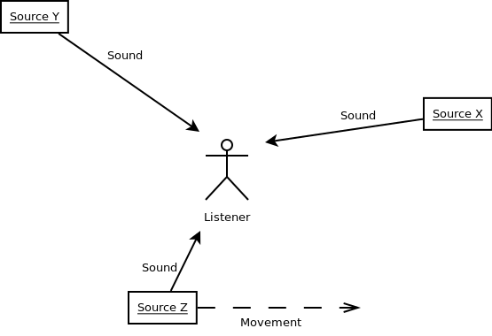
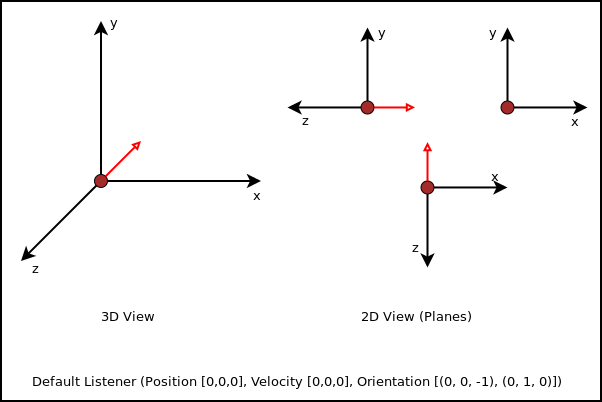
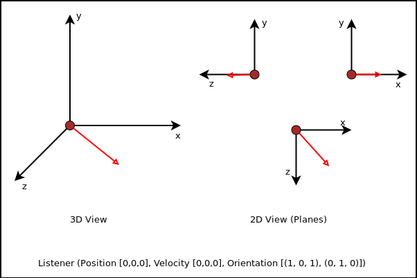
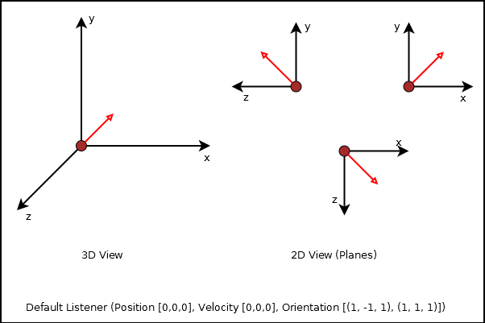

.. module:: openal.audio
   :synopsis: Advanced OpenAL audio module

openal.audio -  advanced sound support
======================================
:mod:`openal.audio` is a set of advanced, pythonic classes for 3D positional
audio support via the OpenAL standard. It utilises :mod:`openal`, but hides all
the :mod:`ctypes` related, sequential programming workflow from you. It is
designed to be non-invasive within a component-based application.

At least three classes need to be used for playing back audio data.
:class:`SoundSink` handles the audio device connection and controls the overall
playback mechanisms. The :class:`SoundSource` represents an in-application
object that emits sounds and a :class:`SoundData` contains the PCM audio data
to be played.

Device handling
^^^^^^^^^^^^^^^
To actually play back sound or to stream sound to a third-party system (e.g. a
sound server or file), an audio output device needs to be opened. It usually
allows the software to access the audio hardware via the operating system, so
that audio data can be recorded or played back. ::

   >>> sink = SoundSink()        # Open the default audio output device
   >>> sink = SoundSink("oss")   # Open the OSS audio output device
   >>> sink = SoundSink("winmm") # Open the Windows MM audio output device
   ...

.. note::

   Depending on what to accomplish and what kind of quality for audio output to
   have, you might want to use a specific audio output device to be passed as
   argument to the :class:`SoundSink` constructor.

It is possible to create multiple :class:`SoundSink` instances for the same
device. OpenAL specifies an additional device-dependent execution context, so
that multiple contexts (with e.g. different settings) can be used on one
device. Likewise, multiple :class:`SoundSink` objects can use the same device,
while each of them uses its own execution context.

.. note::

   Several OpenAL functions perform context-specific operations. If you mix
   function calls from :mod:`openal` with the :mod:`openal.audio`
   module, you should ensure that the correct :class:`SoundSink` is activated
   via :meth:`SoundSink.activate()`.

Placing the listener
--------------------
The OpenAL standard supports 3D positional audio, so that a source of sound can
be placed anywhere relative to the listener (the user of the application or
some in-application avatar).

The image above shows a listener surrounded by three sources of sound. Two are
in front of them, while one is behind the listener, moving from left to right.

OpenAL only knows about a single listener at each time. Each :class:`SoundSink`
can manage its own listener, which represents the user or in-application
avatar. As such, it represents the 'pick-up' point of sounds.

Placing and moving the listener (as well as sound sources in OpenAL) is done in
a RHS coordinate system. That said, the horizontal extent of your monitor
represents the x-axis, the vertical the y-axis and the visual line between your
eyes and the monitor surface reprensents the z-axis.

.. image:: images/coordinate_rhs.png

It is crucial to understand how placing and moving sound sources and the
listener will influence the audio experience. By default, the listener for each
individual :class:`SoundSink` is placed at the center of the coordinate system,
``(0, 0, 0)``. It does not move and looks along the z-axis "into" the monitor
(most likely the same direction you are looking at right now). ::

   >>> listener = SoundListener()
   >>> listener.position = (0, 0, 0)
   >>> listener.velocity = (0, 0, 0)
   >>> listener.orientation = (0, 0, -1, 0, 1, 0)
   ...

While the :attr:`SoundListener.position` and :attr:`SoundListener.velocity` are
quite obvious in their doing, namely giving the listener a (initial) position
and movement, :attr:`SoundListener.orientation` denotes the direction the
listener "looks at". The orientation consists of two components, the general
direction the listener is headed at and rotation. Both are expressed as 3-value
tuples for the x-, y- and z-axis of the coordinate system. ::

   >>> listener.orientation = (0, 0, -1,   0, 1, 0)
   >>> #                       ^^^^^^^^    ^^^^^^^
   >>> #                       direction   rotation

Changing the first 3 values will influence the direction, the listener looks at.
 ::

   >>> listener.orientation = (1, 0, 1, 0, 1, 0)

Changing the last 3 values will influence the rotation of the looking direction.

The orientation defines a orthogonal listening direction, so that any sounds the
user (or avatar) hears, are processed correctly. If you imagine a car driving
by on your right side, while you are looking straight ahead (parallel to the
car's driving direction), you will hear the car on your right side (with your
right ear receiving the most noise). If you look on the street, following the
car with your eyes and head, the listening experience will differ (since both
ears of you receive the noise in nearly the same way).

.. note::

   Setting the orientation in OpenAL is somehat similar ot OpenGL's
   ``gluLookAt`` function, which adjusts the view direction. You might want
   to take a look at http://www.glprogramming.com/red/chapter03.html#name2 for
   further details about that.

Creating sound sources
----------------------
A :class:`SoundSource` represents an object that can emit sounds. It can be any
kind of object and allows you to play any sound, you put into it. In an
application you can enable objects to emit sounds, by binding a
:class:`SoundSource` to them.::

   >>> source = SoundSource()

.. todo::

   more details

Creating and playing sounds
---------------------------
To create and play sounds you use :class:`SoundData` objects, which contain the
raw PCM data to be played. To play the sound, the :class:`SoundData` needs to
be queued on a :class:`SoundSource`, which provides all the necessary
information about the volume, the position relative to the listener and so
on. ::

   >>> wavsound = load_wav_file("vroom.wav")

There are some helper functions, which create :class:`SoundData` objects from
audio files. If you have a raw PCM data buffer, you can create a
:class:`SoundData` from it directly. ::

   >>> rawsound = SoundData(pcmbuf, size_of_buf, channels, bitrate, frequency_in_hz)

Queueing the loaded sound is done via the :meth:`SoundSource.queue()` method,
which appends the sound to the source for processing and playback. ::

   >>> wavsound = load_wav_file("vroom.wav")
   >>> source.queue(wavsound)

You just need to inform the :class:`SoundSink` about the :class:`SoundSource`
afterwards, so that it knows that a new sound emitter is available. ::

   >>> soundsink.play(source)
   
When you add other sounds to play to the source, they will be picked up
automatically for playback, as long as the :class:`SoundSource` is not paused
or ran out of something to play.

API
^^^

.. class:: OpenALError([msg=None[, alcdevice=None]])

   An OpenAL specific exception class. If a new :class:`OpenALError` is created
   and no *msg* is provided, the message will be set a mapped value of
   :meth:`openal.al.alGetError()`. If an :class:`openal.alc.ALCdevice` is
   provided as *alcdevice*, :meth:`openal.alc.alcGetError()` will be used
   instead of :meth:`openal.al.alGetError()`.

.. class:: SoundData(data=None, channels=None, bitrate=None, size=None, \
                     frequency=None, dformat=None)

   The :class:`SoundData` consists of a PCM audio data buffer, the audio
   frequency and additional format information to allow easy buffering through
   OpenAL.

   .. attribute:: channels

      The channel count for the sound data.
      
   .. attribute:: bitrate
   
      The bitrate of the sound data.
      
   .. attribute:: size
   
      The buffer size in bytes.
   
   .. attribute:: frequency
   
      The sound frequency in Hz.
      
   .. attribute:: data
   
      The buffered audio data.
      
.. class:: SoundListener(position=[0, 0, 0], velocity=[0, 0, 0], \
                         orientation=[0, 0, -1, 0, 1, 0])

   A listener object within the 3D audio space.

   .. attribute:: orientation
   
      The listening orientation as 6-value list. 
   
   .. attribute:: position
   
      The listener position as 3-value list.  

   .. attribute:: velocity
   
      The movement velocity as 3-value list.
    
   .. attribute:: gain
    
      The relative sound volume (perceiptive for the listener).

   .. attribute:: changed

      Indicates, if an attribute has been changed.
      
.. class:: SoundSource(gain=1.0, pitch=1.0, position=[0, 0, 0], \
                       velocity=[0, 0, 0])

   An object within the application world, which can emit sounds.

   .. attribute:: gain

      The volume gain of the source.

   .. attribute:: pitch

      The pitch of the source.

   .. attribute:: position

      The (initial) position of the source as 3-value tuple in a x-y-z
      coordinate system.

   .. attribute:: velocity

      The velocity of the source as 3-value tuple in a x-y-z coordinate system.

   .. method:: queue(sounddata : SoundData) -> None

      Adds a :class:`SoundData` audio buffer to the source's processing and
      playback queue.

.. class:: SoundSink(device=None)

   Audio playback system.

   The SoundSink handles audio output for sound sources. It connects to an
   audio output device and manages the source settings, their buffer queues
   and the playback of them.

   .. attribute:: device

      The used OpenAL :class:`openal.alc.ALCdevice`.

   .. attribute:: context

      The used :class:`openal.alc.ALCcontext`.

   .. method:: activate() -> None

      Activates the :class:`SoundSink`, marking its :attr:`context` as the
      currently active one.

      Subsequent OpenAL operations are done in the context of the
      SoundSink's bindings.

   .. method:: set_listener(listener : SoundListener) -> None

      Sets the listener position for the :class:`SoundSink`.

      .. note::

         This implicitly activates the :class:`SoundSink`.

   .. method:: process_source(source : SoundSource) -> None

      Processes a single :class:`SoundSource`.

      .. note::

        This does *not* activate the :class:`SoundSink`. If another
        :class:`SoundSink` is active, chances are good that the
        source is processed in that :class:`SoundSink`.

   .. method:: process(world, components) -> None

      Processes :class:`SoundSource` components, according to their
      :attr:`SoundSource.request`

      .. note::

         This implicitly activates the :class:`SoundSink`.
